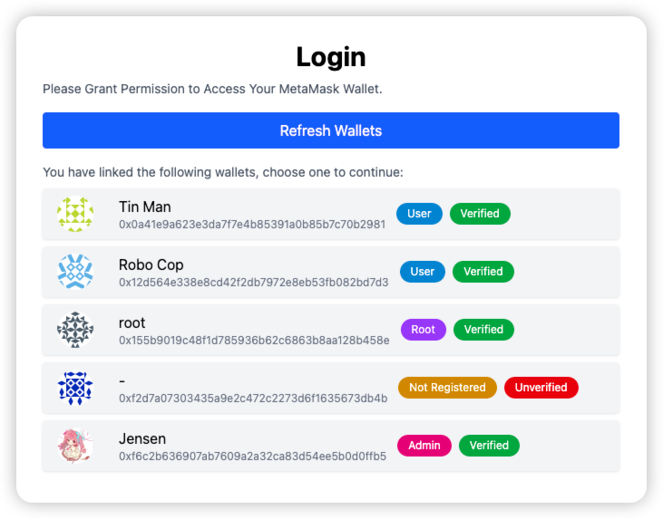
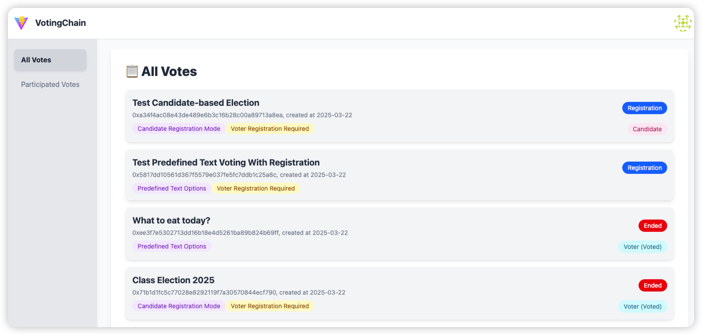
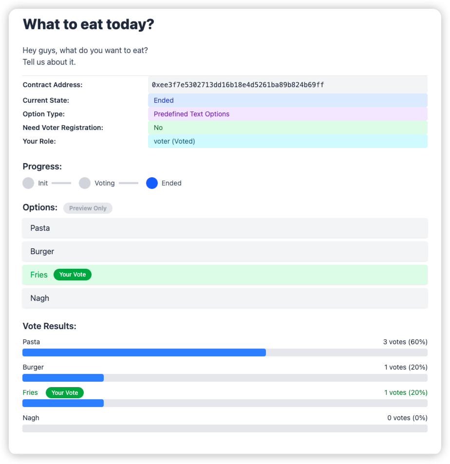
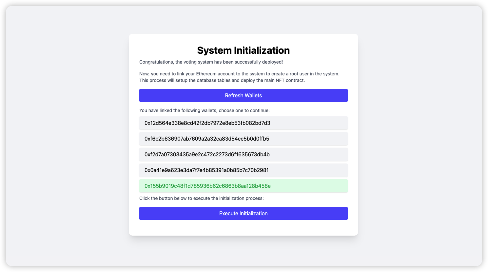

# VotingChain

VotingChain is a decentralized voting system based on Ethereum blockchain. It is designed to provide a secure, 
transparent, and tamper-proof voting system for various scenarios. MIT License.

## Features

- **Candidate Based Voting**: Voters can vote for their favorite candidates who have been registered in the vote session.
- **RawText Based Voting**: Voters can vote for their favorite raw text options.
- **Multiple Voting Sessions**: The system supports multiple voting sessions, each with its own candidates and options.
- **Secure and Transparent**: The voting results are stored on the Ethereum blockchain, which is secure and tamper-proof.
- **ERC-721 Based Voting Token**: Using ERC-721 tokens to represent the voting rights of voters.
- **Multi-user Support**: The system supports multiple users, each with their own Ethereum account.








## Installation

### Prerequisites

You need to have the following tools installed on your machine:

- Node.js (Preferred version: 18.20.7)
- npm (Preferred version: 10.8.2)
- golang (Preferred version: 1.23.7)
- MySQL
- solc@0.8.1

To test the project, you are recommended to install the following tools:

- Ganache
- MetaMask

Prepare your MySQL database, and create a new Schema to get ready for auto-migrated tables.

### Build From Source

```bash
git clone https://github.com/AdemJensen/VotingChain
cd backend
make all
make reset_config

cd ../frontend
npm install
```

The `make all` in `backend` directory will build both golang server and Solidity smart contract source code.

## Development Run

In this section, we will introduce how to run the project on Ganache.

1. Create a new test network, get its `RPC Host` (Usually `http://127.0.0.1:7545`) and `Chain ID` (Usually `1337`, 
note that it is not `Network ID`).
2. Edit `backend/config.json`, modify the following entries: `db.*`, `blockchain.rpcHost`, `blockchain.chainID`. If 
you want to modify the generated root user's email, you can also edit `db.rootUserEmail`.
3. Run command to start:

```bash
cd backend
go run main.go

# on another shell
cd frontend
npm run dev
```

You should see the backend and frontend up and running. If so, open your browser, and access `http://localhost:5173/init`.

Follow the instructions on the webpage, link to your Ethereum account and migrate DB tables.



## Known Issues

### Invalid Opcode

If you encounter the following error when deploying the contract:

```
Error: Returned error: VM Exception while processing transaction: invalid opcode
```

Please make sure you are using solcjs@0.8.1 to compile the contract:

```bash
npm install -g solc@0.8.1
```

If you are using MacOS, please do not use the `solc` installed by brew, it will cause the invalid opcode in the 
compiled artifact, making it impossible to deploy in Ganache.
